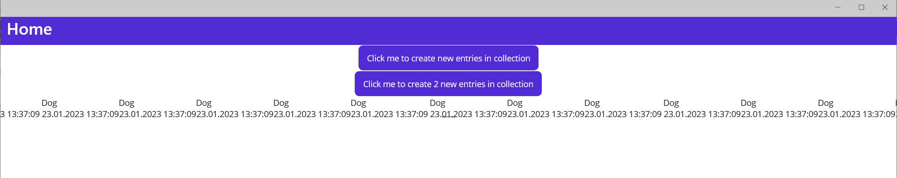
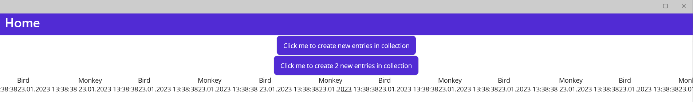

# Maui CarouselView Problems

Shows the problems with MAUI CarouselView on Windows

Just start the application. This will create just 1 item in the ObservableCollection.
If you press the button, the ObervableCollection is cleared and a new item is placed inside the collection.

# MainPage.xaml Loop=false for the CarouselView

On Android, the new item is shown as expected.
On Windows, it still shows the old item. Also, if you would go and change the old item, then those changes would show up, so Windows does not do the binding to the new object.

# MainPage.xaml Loop=true for CarouselView

On Android, the new items show up as expected
On Windows even after startup, a lot of entries are shown (2 errors here: First there should be only 1 entry but there are a lot and second, you should see just one but they are rendered horizontally)

If you click the add 2 items button you see that here the collection is updated but still rendered completly wrong.

